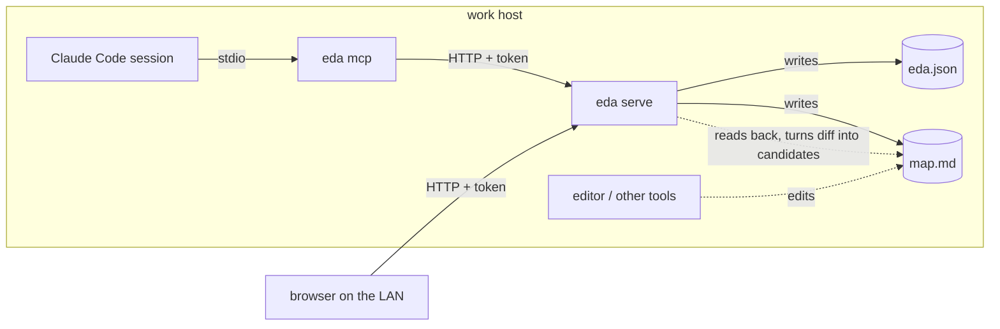
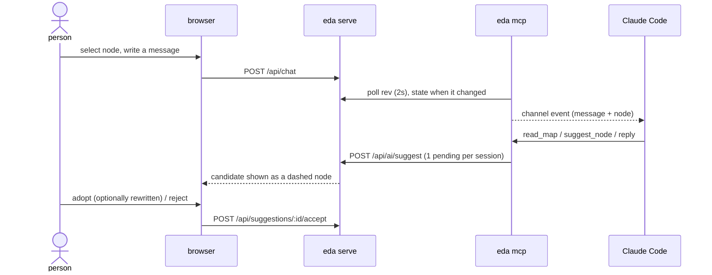

# eda v1 design

Status: implemented in the first PR. Requirements and the decisions behind them (D-01..D-09) were settled before this repo existed; they are summarized under "Decisions carried in".

## Background

- Previous attempts at "make a mind map with an AI" ended with the AI generating a huge map in one go, leaving no room for the person to think.
- eda is a mind map where the AI can only *suggest one node at a time*, and a person adopts or rejects each one.
- The person consults with the same Claude Code session they are already working in, from the map screen.

## Conclusion

- A local Bun server owns the map. The browser and Claude Code both go through it.
- Claude Code's only interface is an MCP server (`eda mcp`) with four tools, none of which write the map: `read_map`, `suggest_node`, `suggest_edit`, `reply`.
- Hand edits of `map.md` are not applied; they become candidates and the file is restored.

## Resources

## One round

## Storage

- A map is a directory. `eda.json` is the source of truth; only the server writes it.
- `map.md` is `# root` followed by 2-space nested bullets, readable by Markmap and Obsidian.
- The server stores the sha256 of the `map.md` it last wrote. Any request first compares; on mismatch the edited outline is diffed against the map by position, new/changed lines become `md-edit` candidates, and `map.md` is rewritten.
- The Claude Code sessions that touched the map are listed in `eda.json` and shown in the header as `claude --resume <id>`.

## Structural limits on the AI

- MCP exposes no write tool. Adoption, deletion, URL/task edits are browser-only routes.
- One AI suggestion per (session, model) can be pending; the next call gets 409 until the person adopts or rejects.
- A suggestion is exactly one node (`suggest_node`) or one node's change (`suggest_edit`).
- Known limit: the person's routes and the AI's routes use the same token, and Claude Code sees it (it reads `~/.eda/token`, and `eda serve` prints it in the URL). With the shell it could call the adopt route directly. The tools and instructions do not offer that path; splitting the credentials is issue-tracked, and closing it fully would need a credential the agent's OS user cannot read.
- Known limit: `eda.json` edited by hand while the server runs is overwritten on the next write; edited while it is stopped, it is the map. Only `map.md` edits are turned into candidates.

## v1 scope of the mind-map features

| Feature | v1 |
|---|---|
| URL attachment (AI via suggestions, person directly) | yes |
| kaneo task link (paste task URL; opens `<host>/dashboard/workspace/<ws>/project/
/task/<t>`) | yes, hidden when no host is configured |
| note | yes |
| collapse | yes |
| origin (human / adopted AI / adopted md edit) | yes |
| labels / icons, relationships, boundaries, summaries, images | later |
| file attachment (`assets/`) | later (D-07 addendum) |
| creating a kaneo task from a node | later (person-only when added) |
| several models suggesting in parallel | later; the slot is per session today and would gain a model key then |

## Decisions carried in

- D-01 personal tool, public repo: machine-specific things are configuration (`~/.config/eda/config.json`, `EDA_KANEO_HOST`, `EDA_HOME`).
- D-02 standalone web app (local server + browser).
- D-03 / D-08 the server owns the map; `map.md` is an export and external edits become candidates.
- D-04 the consulting partner and the suggester is the same Claude Code session.
- D-06 task links per node, any project, stored as ids.
- D-07 URLs only in v1.
- D-09 MCP: read, suggest a node, suggest a change to a node.

## Decided here

- `reply` is a fourth MCP tool so the session can answer in the map's chat. It does not touch the map. (Open for the owner: judgment queue D-10.)
- Frontend is plain TypeScript and CSS bundled by Bun's HTML import; the tree is nested lists drawn with CSS borders, so there is no runtime dependency. Rendering libraries (markmap and the like) were not evaluated; revisit when the layout needs to go beyond a left-to-right tree.
- Auth is one bearer token per host (`~/.eda/token`), passed to the browser in the URL fragment. Same level as akapen.
