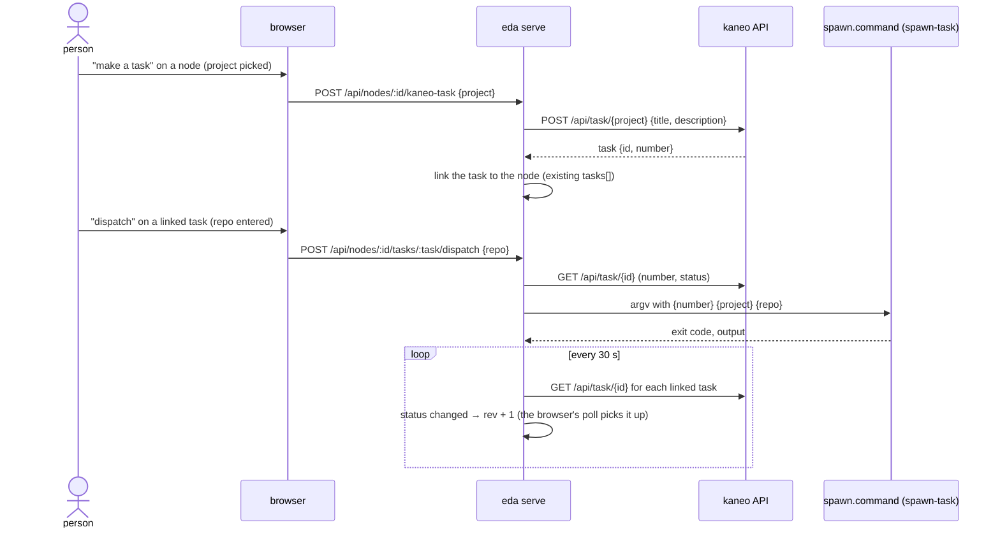

# From a node to a task to a Claude Code session

Status: planned (kaneo eda#45). Folds in kaneo eda#15 (create a kaneo task from a node).

## Background

- Request (kaneo eda#45, verbatim): 「マインドマップを基準において タスクを作っていくのがもっとも理想的であると考える。「頭の中の猿」はあらゆる項目から連想を続け、すぐに忘れていく。マインドマップで 縦割り横割りでの連想要素を洗い出し、そこからタスクを割り出し、claude session に依頼をする。」
- The owner chose three pieces: create a kaneo task from a node, show the task's kaneo status on the node, and start a session for it (`spawn-task`) from the node.
- Today a node can only link a task by pasting its URL. The step from "an idea on the map" to "a task a session works on" is done by hand outside eda, and nothing comes back to the map.

## Conclusion

- Three person-only routes on `eda serve`: create a task from a node, dispatch a linked task to a session, and read the linked tasks' status.
- eda talks to kaneo over its REST API (`<host>/api`, bearer `KANEO_API_KEY`). It does not shell out to the `kaneo` CLI and does not read the CLI's config.
- Dispatch runs a command from eda's config (`spawn.command`, an argv template). eda knows nothing about herdr, ccx or `spawn-task`; with no command configured, there is no dispatch button.
- No MCP tool is added. The AI can still only suggest nodes; turning a node into a task or a session is the person's click.

## Flow



## The task body

- Title: the node's text.
- Description, so the session gets the map's context without the map:
  - the path from the root to the node (the vertical context)
  - the node's siblings and children (the horizontal context)
  - the node's note and URLs
  - where it came from: the map directory and node id
- Priority and status are kaneo's defaults (`medium`, `to-do`).

## Status on the node

- The server keeps the last status it read for each linked task and refreshes them every 30 s in the background. A change bumps `rev`, so the browser's existing 1.5 s poll redraws without a new channel.
- Shown read-only next to the task link and as a small badge on the node. eda's own `doing` / `done` markers stay the person's and are not set from kaneo.
- A task kaneo cannot return (deleted, no access, kaneo down) shows as unknown; it is never unlinked automatically.

## Dispatch

- The server resolves the task number from kaneo, fills `{number}`, `{project}`, `{repo}` (and `{workspace}`, `{task}`) into `spawn.command`, and runs it with `Bun.spawn` — an argv array, no shell.
- Values are checked before they reach argv: number is an integer, ids match kaneo's id shape, repo matches `owner/name`.
- The command's exit code and the tail of its output come back to the browser. `spawn-task` itself refuses a task already in progress, so eda adds no duplicate guard of its own.
- The command inherits `eda serve`'s environment. `spawn-task` needs the kaneo key and herdr, which is the case when the session that started the map runs inside herdr with the key.

## Configuration

```json
{
  "kaneo": { "host": "https://kaneo.example", "workspace": "<workspace id>" },
  "spawn": { "command": ["spawn-task", "{number}", "--project", "{project}", "--repo", "{repo}"] }
}
```

- `KANEO_API_KEY` in the environment. Without it the create / dispatch / status features are hidden; the URL link stays.
- `kaneo.workspace` is where the project picker lists projects from.

## Known limits

- The person's routes and the AI's share one token (issue #2). The new dispatch route widens what the AI could do from the shell: start a session, not only adopt a node. Closing #2 closes this too.
- The status shown is up to 30 s old.

## Not in this slice

- Creating tasks for several nodes at once, or the AI proposing which nodes should become tasks.
- Writing a session's progress back into the map beyond kaneo's status.
